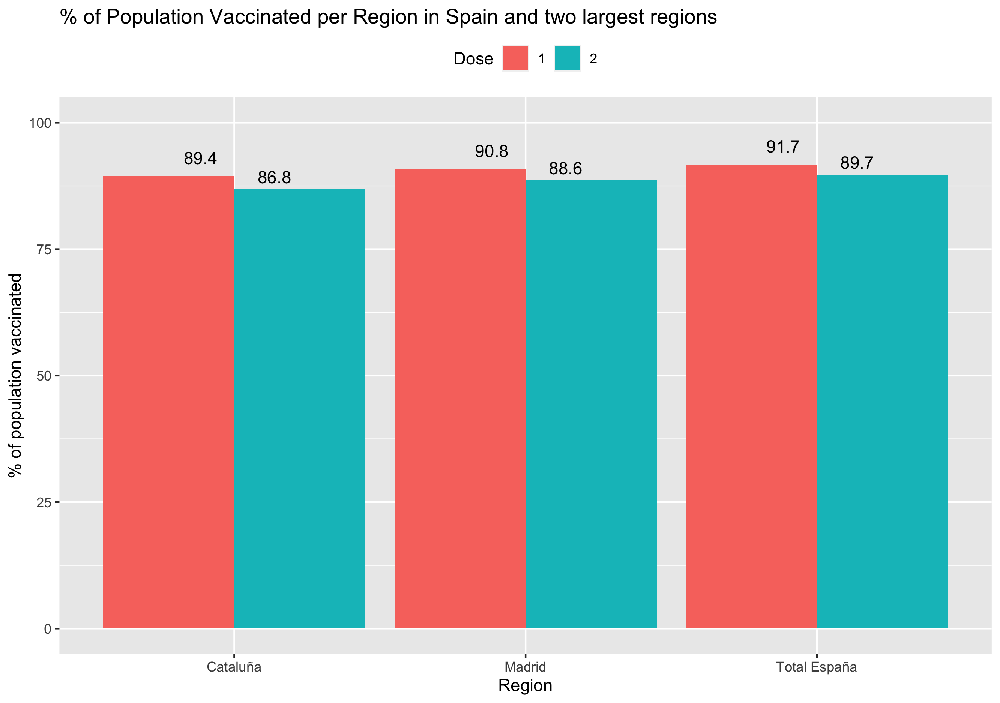

# Covid Spain vaccination

Project Presentation site: https://pablo-ferro.github.io/R-Vaccination-project/

Following Covid Vaccination process in Spain with basic pandas to explore the dataframe and also gganimate dynamic visualization with R.
- Last update: Creating a bar chart with the % vaccinated of one and two dose for Spain total and Madrid and Cataluña regions

